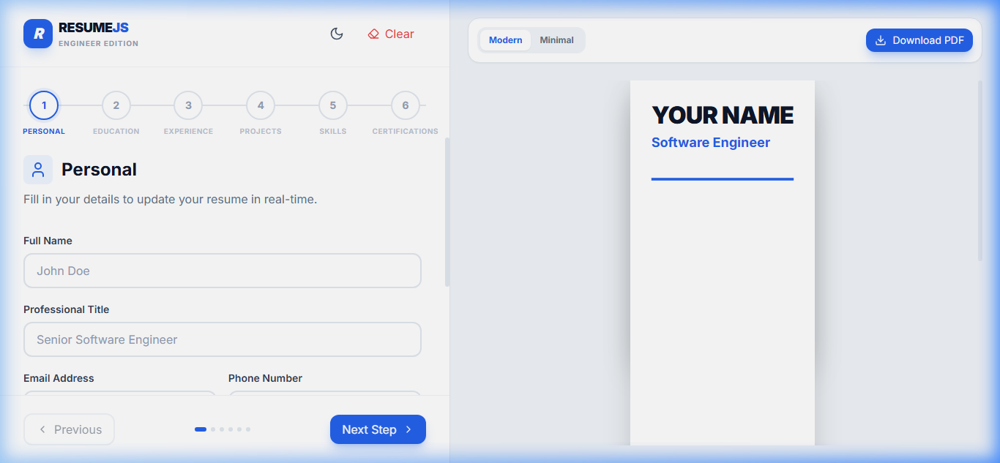
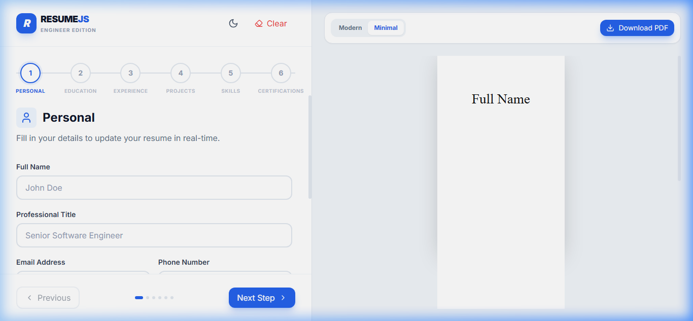
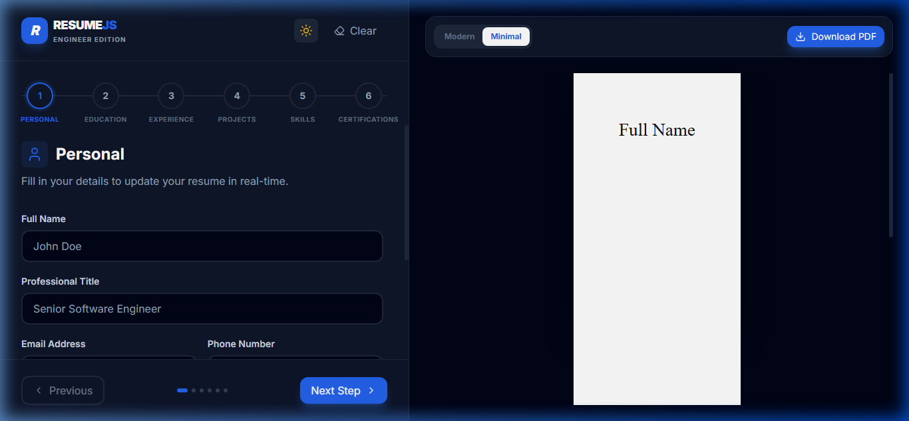

# 🚀 ResumeJS - Premium Resume Builder for Software Engineers

[](https://reactjs.org/)
[](https://tailwindcss.com/)
[](https://vitejs.dev/)

ResumeJS is a modern, high-fidelity web application designed to help Software Engineers build ATS-friendly, professional resumes in minutes. Featuring real-time previews, dynamic section management, and premium templates.

---

## ✨ Key Features

- **🎯 Real-Time Preview**: Watch your resume update instantly as you type.
- **📄 Professional Templates**: 
  - **Modern Developer**: A high-impact, visual-forward design.
  - **Minimal ATS**: A clean, centered, and highly parsable format optimized for recruitment systems.
- **🛠 Dynamic Sections**: Add or remove education, experience, projects, and skills with a single click.
- **🌓 Dark Mode Support**: A sleek dark interface for a premium editing experience.
- **📥 PDF Export**: High-quality A4 PDF generation using `html2pdf.js`.
- **💾 Auto-Save**: Your data is automatically persisted to `localStorage`, so you never lose progress.

---

## 📸 Previews

### Modern Template


### Minimal Template (ATS-Friendly)


### Premium Dark Mode


---

## 🛠 Tech Stack

- **Core**: [React.js](https://reactjs.org/) (Vite)
- **Styling**: [Tailwind CSS](https://tailwindcss.com/)
- **State Management**: React Context API & Hooks
- **Icons**: [Lucide React](https://lucide.dev/)
- **PDF Generation**: [html2pdf.js](https://github.com/eKoopmans/html2pdf.js/)
- **Animations**: [Framer Motion](https://www.framer.com/motion/)

---

## 🚀 Getting Started

### Prerequisites

- [Node.js](https://nodejs.org/) (v16.x or later)
- [npm](https://www.npmjs.com/) or [yarn](https://yarnpkg.com/)

### Installation

1. **Clone the repository**
   ```bash
   git clone https://github.com/Harshb234/resume-builder.git
   cd resume-builder
   ```

2. **Install dependencies**
   ```bash
   npm install
   ```

3. **Start the development server**
   ```bash
   npm run dev
   ```

4. **Open your browser**
   Navigate to `http://localhost:5173/`

---

## 📁 Project Structure

```text
src/
├── components/
│   ├── forms/          # Form sections for education, skills, etc.
│   ├── preview/        # Live preview container and logic
│   └── shared/         # Reusable UI Kit (Button, Input, Stepper)
├── context/            # Global state management (ResumeContext)
├── templates/          # Resume layout designs
└── utils/              # Helper functions (PDF export, etc.)
```

---

## 📝 Usage Tips

- **Skills**: You can create custom categories like "Programming Languages" or "DevOps Tools".
- **Experience**: Use bullet points in descriptions for better ATS readability.
- **Links**: Don't forget to include your LinkedIn and GitHub profiles for a complete developer look.

---

## 🤝 Contributing

Contributions are welcome! Feel free to open an issue or submit a pull request if you have ideas for new templates or features.

---

## 📄 License

Distributed under the MIT License. See `LICENSE` for more information.

---

Built with ❤️ for Software Engineers by [Harsh Bambatkar](https://github.com/Harshb234)
